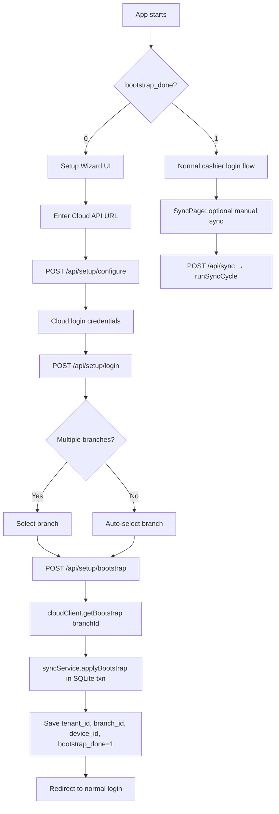
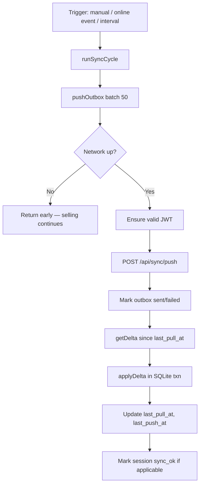

# FluxOne POS — Cloud Sync Engine Roadmap

> **Project:** FluxOne POS (Cashier One) — Desktop Electron app  
> **Cloud sibling:** FluxOne Inventory (PostgreSQL/Supabase)  
> **Cloud base URL:** `https://fluxone-b2b.onrender.com/api`  
> **DB file:** `server/data/fluxone.db`  
> **Last updated:** Phase 8 — contract alignment + production readiness

---

## Executive Summary

Today, POS sync is **fake/local-only**: `POST /api/sync` marks `auth_sessions.sync_ok = 1`, upserts a singleton `sync_state` row (`source = 'local'`), and returns a catalog snapshot from existing SQLite data. No outbound queue, no cloud HTTP calls, no UUID-based catalog.

This roadmap replaces that with a **real cloud-connected sync engine** that:

- Pulls catalog (users, products, categories, taxes, inventory) from cloud on bootstrap + delta
- Pushes sales/refunds/cashier logs via an **outbox queue** (never inline during checkout)
- Keeps **offline selling** working after first bootstrap
- Treats **cloud UUIDs** as source of truth for synced entities

---

## Phase Checklist

| Phase | Scope | Key Deliverables | Status |
|-------|-------|------------------|--------|
| **0** | Document & Plan | This roadmap | ✅ Done |
| **1** | SQLite Migration | `010_sync.sql` — `sync_outbox`, `sync_meta`, optional `pos_counters`, invoice columns | ✅ Done |
| **2** | Cloud HTTP Client | `server/src/modules/sync/cloudClient.js` | ✅ Done |
| **3** | Sync Service Core | `server/src/modules/sync/syncService.js`, models | ✅ Done |
| **4** | Outbox Hooks | Controller inserts into `sync_outbox` on sale/return/exchange/auth/drawer/admin | ✅ Done |
| **5** | Replace Fake Sync | Update `sync.controller.js`, `sync.middleware.js`, routes | ✅ Done |
| **6** | Setup Wizard UI | First-boot provisioning (cloud URL, BM login, auto branch, bootstrap) | ✅ Done |
| **7** | Sync UI + Electron Worker | SyncPage, SyncBadge, syncSlice, `electron/src/main.js` online trigger | ✅ Done |
| **8** | Testing & Handoff | `docs/SYNC_TEST_PLAN.md`, `docs/POS_SYNC_CONTRACT.md`, cloud-only bootstrap | 🔄 In progress |

### Non-Negotiable Rules (all phases)

1. Cloud UUIDs are source of truth for synced entities (users, products, categories, taxes).
2. Branch-scoped pull only — never pull another branch's catalog.
3. Idempotent push — every outbound event has unique `clientEventId`; cloud dedupes.
4. Never sync plain-text passwords — only `passwordHash` (bcrypt).
5. Cloud wins for catalog on pull (prices, products, users) **unless** POS pushed `product_price_update` that Cloud accepted (LWW); subsequent delta echoes the new selling price.
6. POS wins for sales until pushed (outbox queue).
7. Sync failure must **never** block offline selling — only queue and retry.
8. Do **not** call cloud APIs synchronously during checkout — outbox only.
9. Match existing code style: simple, readable, junior-dev friendly.
10. Minimize scope — focused diffs, no over-engineering.

---

## Current State (Verified)

### What exists today

| Component | Location | Behavior |
|-----------|----------|----------|
| Fake sync controller | `server/src/controllers/sync.controller.js` | Marks session synced, returns local snapshot |
| Sync model | `server/src/models/sync.model.js` | `markSessionSynced`, `upsertSyncState`, `getCatalogSnapshot` |
| Sync gate middleware | `server/src/shared/middlewares/sync.middleware.js` | `requireSync` → 403 if `syncOk = 0` |
| Sync UI | `client/src/pages/cashier/sync/SyncPage.jsx` | Online-only sync button, gates POS session |
| Redux sync slice | `client/src/rtk/features/sync/syncSlice.js` | `syncCatalog` thunk → `POST /sync` |
| Sync badge | `client/src/layouts/Navbar/SyncBadge.jsx` | "Synced" vs "Cached Data" |
| `sync_state` table | `004_admin_ops.sql` | Singleton: `last_synced_at`, `source` |
| Migrations | `server/src/database/migrations/001–009` | Run on server boot via `migrate.js` |

### What does NOT exist

- `sync_outbox` table
- `sync_meta` table (beyond minimal `sync_state`)
- `pos_counters` table
- `invoices.payment_method`, `invoices.counter_id`, `invoices.cloud_synced_at`
- Cloud HTTP client or JWT token storage
- Setup/provisioning wizard
- Electron background sync worker

### ID format gap

Seed data uses slug IDs (`prd_cola`, `ADM-001`, `INV-1009`). After bootstrap, synced entities must use **cloud UUIDs**. Legacy slug rows will be replaced on first bootstrap (or migrated if cloud team provides mapping).

### Stock model gap

POS stores stock on `products.stock` directly. Cloud uses `branch_inventory.quantity` per branch. Bootstrap/delta maps `branch_inventory → products.stock` for the configured `branch_id`.

### Category model gap

POS: separate `categories` + `subcategories` tables (`has_subcategories` flag).  
Cloud: single `categories` table with `parent_id` (null = top-level, non-null = child).

---

## SQLite Migration Plan (`010_sync.sql`)

### Migration runner (unchanged)

- File: `server/src/database/migrate.js`
- Applied automatically on server start (`server/index.js` → `connectDb()` → `migrate()`)
- Each migration runs in a `better-sqlite3` transaction; id recorded in `schema_migrations`

### New tables

#### `sync_outbox`

Outbound event queue for POS → Cloud push.

```sql
CREATE TABLE IF NOT EXISTS sync_outbox (
  id              INTEGER PRIMARY KEY AUTOINCREMENT,
  client_event_id TEXT NOT NULL UNIQUE,
  event_type      TEXT NOT NULL CHECK (event_type IN ('sale', 'refund', 'cashier_log', 'attendance')),
  payload         TEXT NOT NULL,          -- JSON
  device_id       TEXT NOT NULL,
  created_at      TEXT NOT NULL DEFAULT (datetime('now')),
  synced_at       TEXT,
  sync_status     TEXT NOT NULL DEFAULT 'pending'
                    CHECK (sync_status IN ('pending', 'sent', 'failed')),
  retry_count     INTEGER NOT NULL DEFAULT 0,
  last_error      TEXT
);

CREATE INDEX IF NOT EXISTS idx_sync_outbox_pending
  ON sync_outbox (sync_status, created_at)
  WHERE sync_status = 'pending';
```

#### `sync_meta` (replaces/extends `sync_state`)

Singleton row (`id = 1`) holding provisioning + sync timestamps.

```sql
CREATE TABLE IF NOT EXISTS sync_meta (
  id              INTEGER PRIMARY KEY CHECK (id = 1),
  tenant_id       TEXT,
  branch_id       TEXT,
  device_id       TEXT,
  cloud_api_url   TEXT,
  last_pull_at    TEXT,
  last_push_at    TEXT,
  bootstrap_done  INTEGER NOT NULL DEFAULT 0 CHECK (bootstrap_done IN (0, 1)),
  -- JWT storage (or separate sync_tokens table if preferred in Phase 2)
  access_token    TEXT,
  refresh_token   TEXT,
  token_expires_at TEXT
);
```

#### Backward compatibility: `sync_state` → `sync_meta`

```sql
-- Migrate existing sync_state data into sync_meta, then keep sync_state
-- readable for one release cycle (sync.model.js updated in Phase 5).
INSERT OR IGNORE INTO sync_meta (id, last_pull_at, bootstrap_done)
SELECT 1, last_synced_at, CASE WHEN last_synced_at IS NOT NULL THEN 1 ELSE 0 END
FROM sync_state WHERE id = 1;
```

> **Decision:** Keep `sync_state` table (do not drop) until Phase 5 controller rewrite. `sync_meta.bootstrap_done` becomes the real gate; `sync_state` can mirror `last_pull_at` for legacy reads.

#### `sync_tokens` (optional — evaluate in Phase 2)

If JWT fields on `sync_meta` feel wrong, use:

```sql
CREATE TABLE IF NOT EXISTS sync_tokens (
  id              INTEGER PRIMARY KEY CHECK (id = 1),
  access_token    TEXT,
  refresh_token   TEXT,
  expires_at      TEXT
);
```

Prefer **sync_meta columns** first (simpler, singleton pattern matches existing `sync_state`).

#### `pos_counters` (optional in same migration)

```sql
CREATE TABLE IF NOT EXISTS pos_counters (
  id        TEXT PRIMARY KEY,       -- cloud UUID
  code      TEXT NOT NULL,
  name      TEXT NOT NULL,
  is_active INTEGER NOT NULL DEFAULT 1 CHECK (is_active IN (0, 1))
);
```

#### `invoices` alterations

```sql
ALTER TABLE invoices ADD COLUMN payment_method TEXT NOT NULL DEFAULT 'cash';
ALTER TABLE invoices ADD COLUMN counter_id TEXT REFERENCES pos_counters(id);
ALTER TABLE invoices ADD COLUMN cloud_synced_at TEXT;
```

### Migration safety checklist

- [ ] All `CREATE TABLE IF NOT EXISTS` — safe on fresh and existing DBs
- [ ] `ALTER TABLE` wrapped in migration only (SQLite has no `IF NOT EXISTS` for columns — use pragma check or accept re-run failure; migration runner skips applied files)
- [ ] Run `npm run migrate` against seeded dev DB — verify no breakage
- [ ] Server boots with `FLUXONE_AUTO_SEED=1` — existing flows still work
- [ ] `auth_sessions.sync_ok` logic unchanged until Phase 5

---

## Bootstrap / Provisioning Flow

### First boot (bootstrap_done = 0)



### Subsequent sync (bootstrap_done = 1)



### Device ID

- Generated once on first setup: `crypto.randomUUID()`
- Persisted in `sync_meta.device_id`
- Sent with every push event for cloud dedup / audit

### Cloud endpoints used

| Step | Method | Endpoint |
|------|--------|----------|
| Login | POST | `/api/auth/login` |
| Refresh | POST | `/api/auth/refresh` |
| Bootstrap | GET | `/api/sync/bootstrap?branchId={uuid}` |
| Delta | GET | `/api/sync/delta?branchId={uuid}&since={iso}` |
| Push | POST | `/api/sync/push` |

**Do NOT use** legacy `GET /api/sync/pull` — it is not the catalog bootstrap endpoint.

---

## Outbox Worker Algorithm

### Insert (Phase 4 — synchronous, same DB transaction as sale)

```
ON transaction success (sale / return / exchange / cashier_log):
  1. Build payload via mapper (mapInvoiceToSaleEvent, etc.)
  2. Generate clientEventId = "pos-{invoiceId}-{Date.now()}" or UUID
  3. INSERT INTO sync_outbox (
       client_event_id, event_type, payload, device_id,
       sync_status = 'pending'
     )
  4. COMMIT local transaction
  -- NO cloud HTTP call here
```

### Push worker (`pushOutbox(batchSize = 50)`)

```
function pushOutbox(batchSize = 50):
  if NOT isNetworkOnline():
    return { pushed: 0, reason: 'offline' }

  if NOT ensureValidJwt():
    return { pushed: 0, reason: 'auth_failed' }

  rows = SELECT * FROM sync_outbox
         WHERE sync_status = 'pending'
         ORDER BY created_at ASC
         LIMIT batchSize

  if rows.length === 0:
    return { pushed: 0 }

  events = rows.map(r => ({
    clientEventId: r.client_event_id,
    eventType: r.event_type,
    payload: JSON.parse(r.payload),
    deviceId: r.device_id
  }))

  try:
    response = cloudClient.pushEvents(events)

    for each accepted event in response:
      UPDATE sync_outbox
        SET sync_status = 'sent', synced_at = datetime('now')
        WHERE client_event_id = event.clientEventId

      -- Optionally mark invoice.cloud_synced_at

    for each rejected event in response:
      UPDATE sync_outbox
        SET sync_status = 'failed',
            retry_count = retry_count + 1,
            last_error = event.error
        WHERE client_event_id = event.clientEventId

  catch network error:
    -- Do NOT mark failed — leave pending for retry
    log error, return

  catch 401:
    attempt token refresh, retry once

  catch 5xx:
    increment retry_count, leave pending if retry_count < MAX_RETRIES
    else mark failed

  UPDATE sync_meta SET last_push_at = datetime('now')
```

### Retry policy

| Condition | Action |
|-----------|--------|
| Offline | Skip push, leave `pending` |
| Network timeout | Leave `pending`, retry next cycle |
| 401 Unauthorized | Refresh JWT, retry once |
| 422 Validation | Mark `failed`, log `last_error` (needs manual review) |
| 5xx Server error | Increment `retry_count`, stay `pending` until max (e.g. 10) |
| 200/202 Accepted | Mark `sent` |

### Triggers for push worker

1. `POST /api/sync` (manual "Sync Now")
2. Electron `online` event (debounced, e.g. 5s)
3. Optional interval (e.g. every 5 minutes when online)
4. **Never** during checkout transaction

---

## Field Mapping Summary (POS ↔ Cloud)

### Users / Employees

| Cloud (`users`) | POS (`employees`) | Notes |
|-----------------|-------------------|-------|
| `id` (UUID) | `id` | Cloud UUID becomes PK |
| `email` | `user_id` | Login identifier |
| `email` | `email` | Also populate `email` column (008 migration) |
| `name` | `name` | |
| `password_hash` | `password_hash` | Never plain text |
| `roles.slug = b2b_admin` | `role = admin` | |
| `roles.slug = cashier` | `role = cashier` | Branch-scoped |
| `roles.slug = supervisor` | `role = supervisor` | If cloud sends it |
| `is_active` | `is_active` | Deactivated users blocked after pull |
| — | `pin_hash` | POS-only, not synced |
| — | `offline_until` | POS-only cashier offline window |

**Pull filter:** cashier (this branch) + b2b_admin (tenant). **Do NOT pull** `inventory_manager`.

### Categories

| Cloud (`categories`) | POS | Notes |
|----------------------|-----|-------|
| `id` (UUID) | `categories.id` or `subcategories.id` | |
| `name` | `name` | |
| `parent_id IS NULL` | `categories` row | `has_subcategories` derived from children |
| `parent_id IS NOT NULL` | `subcategories` row | `category_id = parent_id` |
| `sort_order` | `sort_order` | |
| `is_active` | `is_active` | |

### Products

| Cloud (`products`) | POS (`products`) | Notes |
|--------------------|------------------|-------|
| `id` (UUID) | `id` | |
| `item_code` | `sku` | |
| `barcode` | `barcode` | |
| `name` | `name` | |
| `selling_price` | `price` | Cloud wins on pull |
| `category_id` | `category_id` / `subcategory_id` | Map via category mapper |
| `discount` | `discount` | If cloud provides |
| `image_url` | `image_url` | |
| `is_active` | `is_active` | |

### Branch Inventory → Stock

| Cloud (`branch_inventory`) | POS (`products`) | Notes |
|----------------------------|------------------|-------|
| `product_id` | `products.id` | |
| `branch_id` | — | Filtered by `sync_meta.branch_id` |
| `quantity` | `stock` | Overwrite on pull |

### Taxes

| Cloud (`taxes`) | POS (`tax_rules`) | Notes |
|-----------------|---------------------|-------|
| `id` (UUID) | `id` | |
| `name` | `name` | |
| `rate` | `rate` | |
| `is_active` | `is_active` | |

| Cloud (`product_taxes`) | POS (`product_taxes`) | Notes |
|-------------------------|----------------------|-------|
| `product_id` | `product_id` | |
| `tax_id` | `tax_rule_id` | |

### Sales (Push: POS → Cloud)

| POS | Cloud (`sales` / push payload) | Notes |
|-----|----------------------------------|-------|
| `invoices.id` | `sale_number` | |
| `invoice_items` | `sale_items` | Line-level detail |
| `invoices.employee_id` | `cashier_id` | Cloud UUID |
| `invoices.counter_id` | `counter_id` | After pos_counters sync |
| `invoices.payment_method` | `payment_method` | Default `'cash'` |
| `invoices.subtotal` | `subtotal` | |
| `invoices.tax` | `tax` | |
| `invoices.discount` | `discount` | |
| `invoices.total` | `total` | |
| `invoices.tendered` | `tendered` | |
| `invoices.change_due` | `change_due` | |
| `invoices.created_at` | `sold_at` | ISO timestamp |
| `invoices.type = Return` | `eventType: refund` | |
| `invoices.type = Sale` | `eventType: sale` | |
| `invoices.type = Exchange` | `sale` or `refund` | **TBD — see open questions** |

### Store / Company Settings

| Cloud (`company` / tenant settings) | POS (`store_profile`) | Notes |
|---------------------------------------|----------------------|-------|
| `name` | `name` | |
| `phone` | `contact_phone` | |
| `email` | `contact_email` | |
| `address` | `address` | |
| `currency` | `currency` | |
| `return_policy` | `return_instructions` | |
| `warning_message` | `warning_message` | |
| `open_time` / `close_time` | `shop_open_time` / `shop_close_time` | |

### Counters

| Cloud (`counters`) | POS (`pos_counters`) | Notes |
|--------------------|----------------------|-------|
| `id` (UUID) | `id` | |
| `code` | `code` | |
| `name` | `name` | |
| `is_active` | `is_active` | |

### Cashier Logs (Push)

| POS (`activity_logs`) | Cloud push `cashier_log` | Notes |
|-----------------------|--------------------------|-------|
| `action` | `action` | `login`, `logout`, `open_cash_drawer`, `close_cash_drawer`, `price_change`, `change_cashier` |
| `employee_id` | `employeeId` | POS local id (not necessarily cloud user UUID) |
| — | `actorUserId` | `employees.user_id` when available |
| — | `actorName` | **Required for BM Logs UI** |
| — | `actorRole` | `cashier` / `admin` / `supervisor` |
| `entity_type` / `entity_id` | `entityType` / `entityId` | Context |
| `details` (JSON) | `metadata` | Always an object |
| `created_at` | `timestamp` | ISO-8601 |
| sync meta | `branchId` / `deviceId` | When provisioned |

Sale / return / exchange stay as `sale` / `refund` events (not duplicate `cashier_log`). Lock / unlock / sync stay local-only.

### Role mapping reference

| Cloud role slug | POS role |
|-----------------|----------|
| `b2b_admin` | `admin` |
| `cashier` | `cashier` |
| `branch_manager` | `admin` or `supervisor`? | **TBD** |
| `inventory_manager` | — | **Not pulled** |

---

## File Plan (Phases 1–8)

### Server — new files

```
server/src/modules/sync/
  cloudClient.js          # Phase 2
  syncService.js          # Phase 3
  mappers/
    userMapper.js
    categoryMapper.js
    productMapper.js
    saleEventMapper.js
    cashierLogMapper.js

server/src/models/
  syncMeta.model.js       # Phase 3
  syncOutbox.model.js     # Phase 3

server/src/controllers/
  setup.controller.js     # Phase 6

server/src/routes/
  setup.routes.js         # Phase 6

server/src/database/migrations/
  010_sync.sql            # Phase 1
```

### Server — modified files

```
server/src/controllers/sync.controller.js     # Phase 5
server/src/controllers/sale.controller.js     # Phase 4
server/src/controllers/return.controller.js   # Phase 4
server/src/controllers/exchange.controller.js # Phase 4
server/src/controllers/auth.controller.js     # Phase 4
server/src/controllers/cashDrawer.controller.js # Phase 4
server/src/controllers/admin.controller.js    # Phase 4 (price change)
server/src/shared/middlewares/sync.middleware.js # Phase 5
server/src/routes/sync.routes.js              # Phase 5
server/src/models/sync.model.js               # Phase 5 (delegate to syncMeta)
```

### Client — modified / new files

```
client/src/pages/cashier/sync/SyncPage.jsx    # Phase 6–7
client/src/pages/setup/SetupWizard.jsx        # Phase 6 (new)
client/src/rtk/features/sync/syncSlice.js     # Phase 7
client/src/layouts/Navbar/SyncBadge.jsx       # Phase 7
client/src/api/endpoints.js                   # Phase 6–7
electron/src/main.js                          # Phase 7
```

---

## Middleware Gate Change (Phase 5)

**Today:** `requireSync` checks `req.auth.syncOk` (set after fake `POST /sync`).

**Target:**

```
syncOk = sync_meta.bootstrap_done === 1
         AND (optional: catalog has ≥1 active product OR bootstrap was recent)
```

- Do **not** require cloud to be online for selling after bootstrap
- `auth_sessions.sync_ok` can still be set on successful sync cycle for UI badge
- Cash drawer / checkout blocked only until first bootstrap completes

---

## Open Questions for Cloud Team

### P0 — Blockers for Phase 2–3

1. **Bootstrap endpoint readiness** — Is `GET /api/sync/bootstrap?branchId={uuid}` live on `https://fluxone-b2b.onrender.com`? What is the exact response JSON schema?
2. **Delta endpoint readiness** — Is `GET /api/sync/delta?branchId={uuid}&since={iso}` live? What entities are included in delta vs full bootstrap?
3. **Push endpoint** — Is `POST /api/sync/push` live? Response format for accepted/rejected events?
4. **Push response codes** — HTTP 200 vs 202 for partial acceptance? How are duplicate `clientEventId` responses handled (idempotent replay)?
5. **Branch list on login** — Does `POST /api/auth/login` return available branches for the provisioning wizard, or is a separate endpoint needed?
6. **Setup credentials** — Which roles can run bootstrap? Branch Manager? B2B Admin only?

### P1 — Needed before Phase 4

7. **Exchange event contract** — Does exchange map to one `sale` event, one `refund` + one `sale`, or a new `exchange` event type?
8. **Partial refund** — How does cloud represent partial returns? Single `refund` event with line items?
9. **Sale number format** — Does cloud accept POS-generated invoice IDs (e.g. `INV-1009`) or require UUID / specific format?
10. **Counter assignment** — Is `counter_id` required on every sale push? How are counters scoped (branch-level)?
11. **Offers** — Bootstrap returns `offers` — how should POS apply them locally (or ignore for P1)?

### P2 — Nice to have

12. **Attendance event** — Schema for `attendance` event type?
13. **branch_manager role** — Map to POS `admin` or `supervisor`?
14. **Supervisor PIN** — Is `supervisor_pin_hash` synced from cloud or POS-only?
15. **Image URLs** — Absolute URLs or relative paths requiring base URL prefix?
16. **Deactivated product behavior** — Soft-delete (`is_active = 0`) or hard remove from POS on delta?
17. **Stock conflicts** — If POS sold offline and cloud stock diverges, does delta overwrite local `products.stock` unconditionally?
18. **JWT storage** — Recommended token lifetime and refresh flow for long-running POS terminals?
19. **Rate limiting** — Any limits on bootstrap size or push batch size we should respect?
20. **Render cold start** — Expected latency for first request after idle; should POS show a "waking cloud" message?

---

## Recommended Implementation Order

| Order | Phase | Why |
|-------|-------|-----|
| 1 | Phase 1 — `010_sync.sql` | Tables must exist before models/services |
| 2 | Phase 2 — `cloudClient.js` | Network layer for bootstrap/push |
| 3 | Phase 3 — `syncService.js` | Bootstrap apply seeds UUID catalog |
| 4 | Phase 4 — Outbox hooks | Sales queue locally |
| 5 | Phase 5 — Push worker + replace fake sync | Cloud receives events |
| 6 | Phase 6 — Setup wizard | First-boot provisioning |
| 7 | Phase 7 — UI + Electron worker | Background sync UX |
| 8 | Phase 8 — Test plan + handoff | Validation + cloud coordination |

---

## Risk Register

| Risk | Mitigation |
|------|------------|
| Cloud endpoints not ready | Phase 2 client can mock responses; gate Phase 3 integration on cloud confirmation |
| UUID migration breaks existing seed data | Bootstrap replaces catalog; dev re-seed or wipe DB on first cloud connect |
| Slug IDs in flight sales before bootstrap | Block selling until `bootstrap_done = 1` |
| Render cold start timeouts | Generous fetch timeout + retry; never block checkout |
| Exchange mapping unclear | Ship sale + refund separately if cloud confirms; document in SYNC_TEST_PLAN |
| JWT expiry during long shift | Auto-refresh in `cloudClient.ensureValidJwt()` |

---

## References

- Cloud API base: `https://fluxone-b2b.onrender.com/api`
- Current fake sync: `server/src/controllers/sync.controller.js`
- Migration runner: `server/src/database/migrate.js`
- Electron entry: `electron/src/main.js`
- Master prompt: Phase 0–8 execution spec (this document derived from it)
